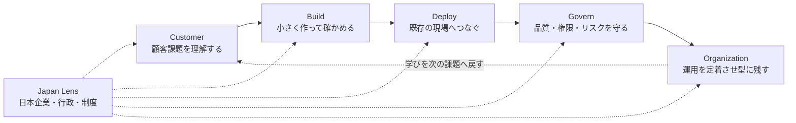
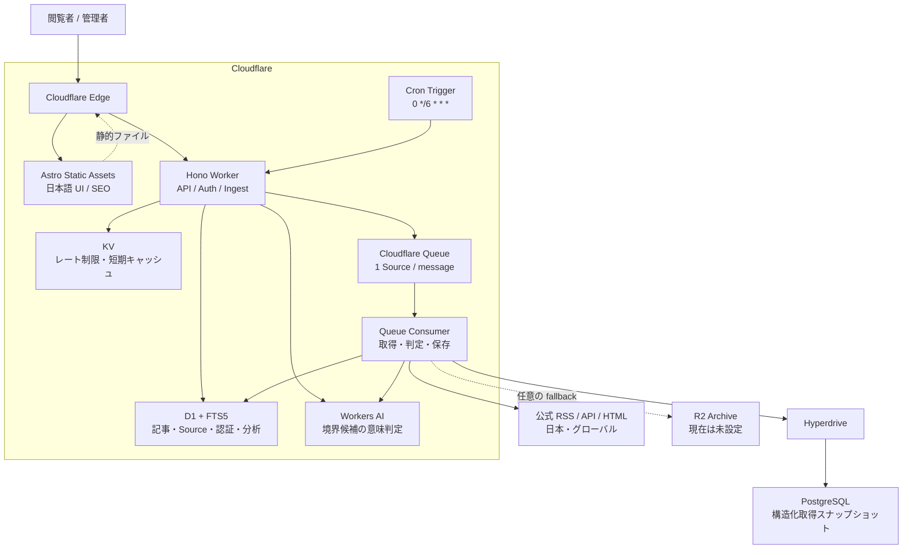
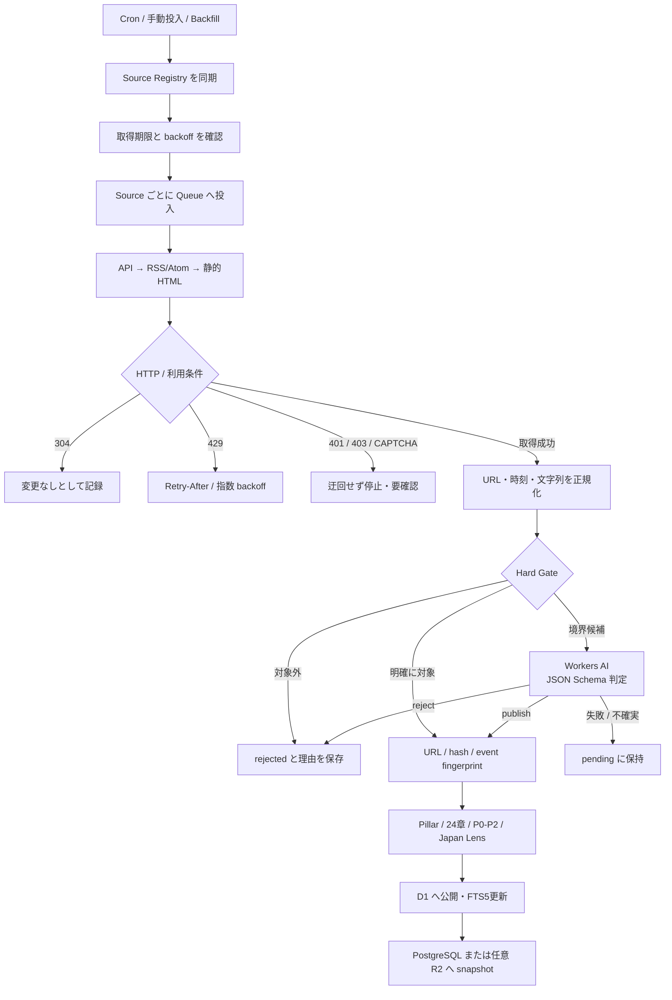
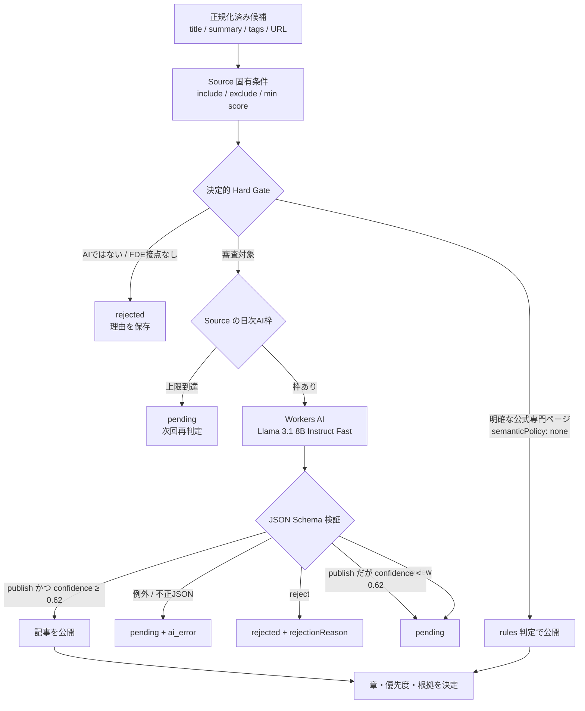
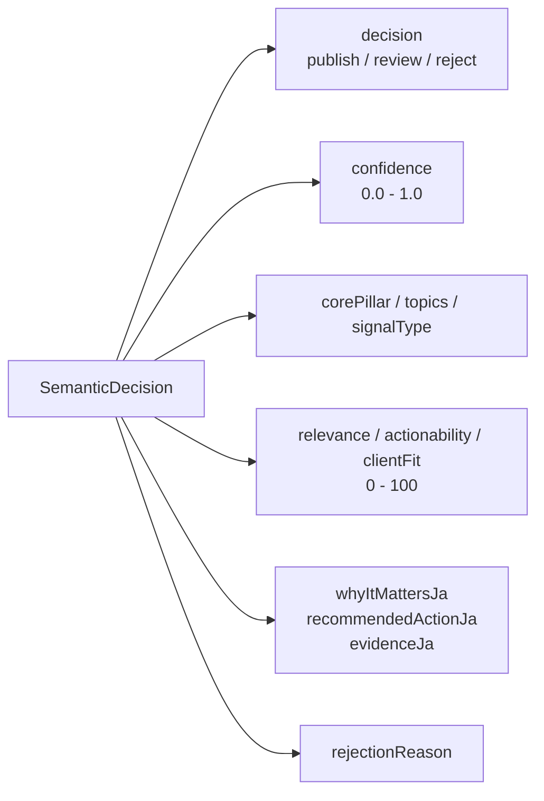
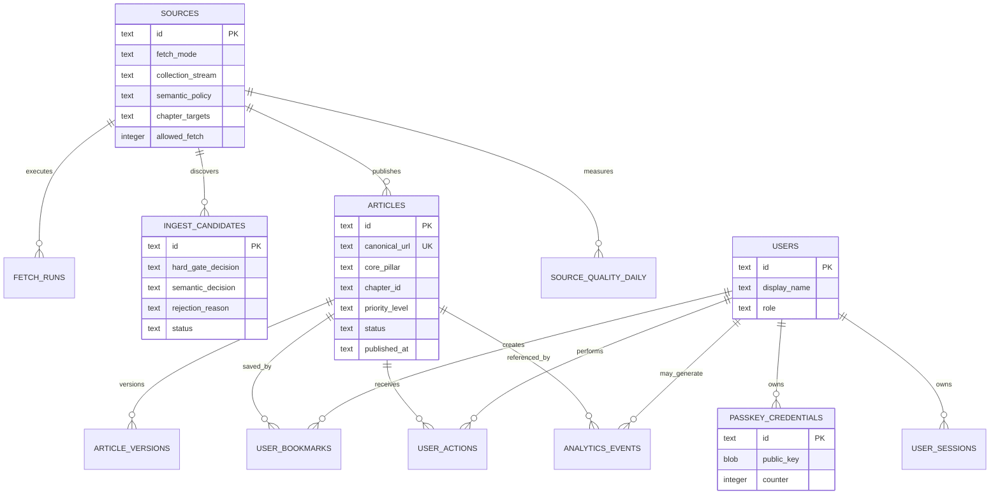
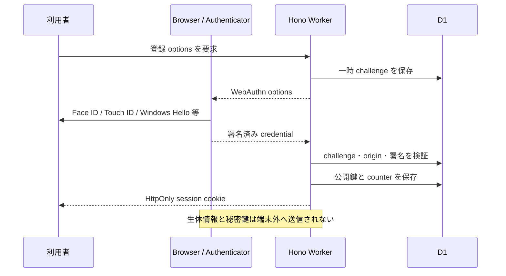
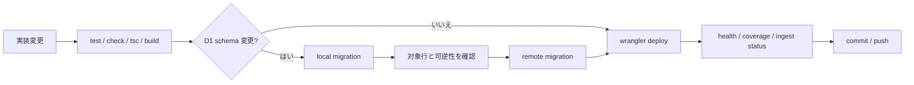
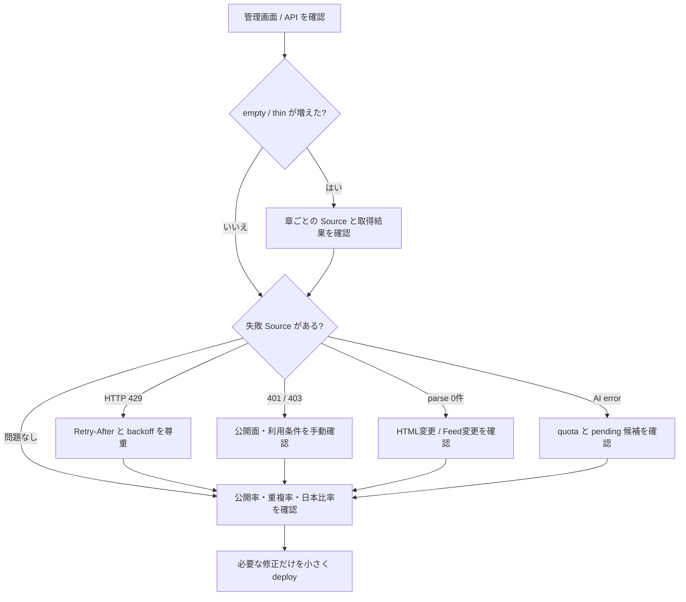

# FDE RADAR

> AI を「試した」で終わらせず、顧客の現場で使える成果へつなげるための、日本語フィールドインテリジェンス。

[公開サイト](https://fde-radar.kekincai.workers.dev) · [収集・判定の詳細](docs/ingestion-architecture.md) · [Issue](https://github.com/kekincai/fde/issues)

FDE Radar は一般的な AI ニュース集約サイトではありません。公式発表、導入事例、実装知見、制度、安全性、組織変革、採用情報を集め、`Customer → Build → Deploy → Govern → Organization` の実務ループと24の問いに整理します。

対象はエンジニアだけではありません。AI を導入する企業、現場担当者、意思決定者、FDE という役割を知りたい人が、一次情報を起点に「何が変わったか」「なぜ重要か」「次に何を確かめるか」を理解するためのサイトです。

## 目次

- [FDE Radar が扱うもの](#fde-radar-が扱うもの)
- [システム構成](#システム構成)
- [収集と公開判定](#収集と公開判定)
- [Workers AI による編集審査](#workers-ai-による編集審査)
- [データ構造](#データ構造)
- [パスキー認証](#パスキー認証)
- [ローカル開発](#ローカル開発)
- [Cloudflare の構築](#cloudflare-の構築)
- [デプロイと変更手順](#デプロイと変更手順)
- [収集の運用](#収集の運用)
- [日常メンテナンス](#日常メンテナンス)
- [障害対応](#障害対応)
- [API](#api)
- [プライバシー、著作権、安全境界](#プライバシー著作権安全境界)

## FDE Radar が扱うもの



`Japan` は6番目の Pillar ではなく、すべての工程を横断する Region / Japan Lens です。

### 24章のナレッジマップ

| 観点 | このサイトが答える問い |
|---|---|
| Customer | 顧客課題、ユースケース、業務プロセス、成果・ROI |
| Build | Agent、RAG・検索、連携・Connector、Legacy刷新 |
| Deploy | Cloud・本番化、On-prem・閉域、Data、Identity・権限、Observability、Cost |
| Govern | Security、Evaluation、Privacy、Regulation、Reliability |
| Organization | FDEの役割、AI CoE、Change Management、人材・採用、AI-native組織 |

各章には最低記事数と最低 Source 数を設定しています。`GET /api/coverage` は記事数、供給 Source 数、日本記事数、推奨アクション付き記事数、最終公開日を返し、`healthy / thin / empty` を判定します。

## 主な機能

- 6時間ごとの自動収集と、1 Source = 1 Queue message の障害分離
- 24章のナレッジマップ、章・地域・優先度・テーマ別フィルター
- D1 FTS5 を使った日本語検索と10件単位のページング
- P0（今日対応）/ P1（今週検証）/ P2（背景学習）の判断レベル
- メールアドレスとパスワードを使わないパスキー登録・ログイン
- ログインユーザーの記事保存とセッション管理
- 管理者専用の利用状況、Source 品質、収集状態ダッシュボード
- IP、検索語、生体情報、パスキー内容を保存しない最小限の製品分析
- 2026年6月1日以降を公開ベースラインとした履歴管理

## システム構成



### コンポーネントの責任

| コンポーネント | 責任 | 保存するもの |
|---|---|---|
| Astro + React | 公開画面、検索・絞り込み、パスキー UI、管理画面 | ビルド済み静的アセット |
| Hono Worker | API、認証、ランキング、収集制御、Queue consumer | 永続データを直接保持しない |
| D1 | 公開記事、Source、判定履歴、ユーザー、保存、分析 | サービスの正本メタデータ |
| FTS5 | 日本語検索用インデックス | タイトル、要約、タグ、検索トークン |
| Workers AI | ルールだけでは判定できない候補の意味判定 | 結果は D1 に監査情報として保存 |
| Queues | Source ごとの非同期実行と再試行 | 一時的な ingest message |
| KV | 認証レート制限、短期状態 | TTL 付きデータ |
| Hyperdrive + PostgreSQL | 許可された構造化取得スナップショット | `fde.source_archives` |
| R2 | PostgreSQL を使わない構成の任意 fallback | JSON スナップショット |

R2 は現在の本番構成では必須ではありません。Hyperdrive と PostgreSQL を優先し、`ARCHIVE` binding が存在する場合だけ R2 を fallback として使います。

## 収集と公開判定



AI という語があるだけでは公開しません。次のいずれかに具体的な接点が必要です。

- 顧客課題、業務プロセス、導入成果、ROI
- Agent、RAG、Connector、MCP、Legacy 刷新
- 本番化、閉域、データ境界、認証、権限、監視、費用
- 評価、プライバシー、セキュリティ、規制、信頼性
- FDE、AI CoE、組織定着、AI-native な働き方

モデル性能だけの記事、一般的な AI ニュース、AI と無関係な官公庁公告、入門チュートリアル、対象外求人は除外します。判定器の詳細は [docs/ingestion-architecture.md](docs/ingestion-architecture.md) を参照してください。

### 優先度

| 優先度 | 意味 | 代表例 |
|---|---|---|
| P0 | 今日対応 | 直近14日以内の明確な脆弱性、侵害、破壊的変更、提供終了 |
| P1 | 今週検証 | 本番化、認証、監視、連携、費用などの実装・運用候補 |
| P2 | 背景学習 | 論文、調査、採用、組織、長期的な判断材料 |

単に「セキュリティ」「期限」と書かれているだけでは P0 にしません。

## Workers AI による編集審査

Workers AI は記事を大量生成するためではなく、決定的なルールだけでは FDE との意味的な関係を判断しにくい候補を審査するために使います。取得した外部記事を無条件でモデルへ渡すことはありません。



### モデル設定

| 項目 | 現在の設定 |
|---|---|
| Binding | Cloudflare Workers AI `AI` |
| Model | `@cf/meta/llama-3.1-8b-instruct-fast` |
| Temperature | `0` |
| 最大出力 | `600` tokens |
| 入力 | Source名、収集 stream、タイトル、最大3,500文字の概要、タグ、原典URL |
| 出力 | JSON Schema に一致する構造化データのみ |
| 公開条件 | `decision = publish` かつ `confidence >= 0.62` |

モデルへ全文ページやユーザー情報は送りません。入力は Source が公開したタイトル、短い概要、タグ、URL と収集側メタデータです。

この処理は「記事全文の自動要約」と同じではありません。AI 審査対象では公開可否と FDE 上の意味、次の行動、根拠を生成しますが、`semanticPolicy: none` の公式専門ページは Source の公開要約と決定的ルールを使います。原文にない顧客成果や数値を補完することはしません。

### AI が返す項目



`whyItMattersJa`、`recommendedActionJa`、`evidenceJa` は日本語で短く返すよう要求し、記事に存在しない事実を作らないことを system prompt で制約しています。文字列長とスコア範囲は Worker 側でも正規化します。

### Source ごとの審査方針

| `semanticPolicy` | 動作 | 用途 |
|---|---|---|
| `required` | Hard Gate を通った候補を Workers AI で審査 | ニュース、一覧ページ、コミュニティ、研究など |
| `fallback` | Hard Gate が `review` の候補だけ審査 | ルールで明確な記事は直接扱い、境界だけAIへ渡す場合 |
| `none` | Workers AI を呼ばず、Hard Gate と固定分類で処理 | 内容が限定された公式ガイド、価格、制度、専門ページ |

`none` は「無審査」ではありません。Source の利用範囲、Hard Gate、最低 score、重複排除、固定章、公開 baseline を通過する必要があります。

### 費用と過負荷の制御

各 Source は `dailyItemCap` を持ち、その日の `semantic_reviewed_count` を差し引いて Workers AI の残り枠を計算します。枠を超えた候補は捨てずに `pending` へ残します。これにより、一覧ページの大量更新や parser 異常が Workers AI quota を一度に消費することを防ぎます。

### 監査可能性

AI の判断は次の場所へ保存します。

- `ingest_candidates`: Hard Gate、AI decision、confidence、model、除外理由、解析時刻
- `articles`: 公開時の semantic decision、model、判定時刻、理由、推奨アクション、根拠
- `source_quality_daily`: AI審査数、AI除外数、AIエラー数

モデルや prompt を変更するときは、既存の `rejected` を無条件に公開へ戻しません。対象候補だけを再審査し、公開率、誤収録、`pending`、AIエラーの差を確認します。

## データ構造



重要なテーブルは次の通りです。

| テーブル | 用途 |
|---|---|
| `sources` | 取得面、優先度、失敗状態、ETag、章の供給責任 |
| `fetch_runs` | Source ごとの成功・失敗、発見数、backfill 情報 |
| `ingest_candidates` | Hard Gate と Workers AI の判定監査 |
| `articles` | 公開・抑制・アーカイブされた記事メタデータ |
| `articles_fts` | FTS5 検索インデックス |
| `article_versions` | タイトル・要約が変わったときの履歴 |
| `source_quality_daily` | 発見、除外、公開、重複、AI エラーの日次集計 |
| `users` / `passkey_credentials` / `user_sessions` | パスキー認証と権限 |
| `user_bookmarks` / `user_actions` | 保存と記事行動 |
| `analytics_events` | 最小限の利用状況分析 |

記事の `status` は公開状態を表します。

- `published`: 公開 API と画面に表示
- `pending`: 再判定待ち
- `rejected`: 収録条件を満たさない
- `suppressed`: 監査用に保持するが公開しない
- `archived`: 公開ベースライン以前など、履歴として保持

## パスキー認証



メールアドレスとパスワードは収集しません。D1 に保存するのは表示名、WebAuthn 公開鍵、署名 counter、端末種別、セッション token のハッシュです。セッション cookie は `HttpOnly / Secure / SameSite=Lax`、有効期間は30日です。

新規ユーザーの role は常に `member` です。管理 API は画面表示だけに頼らず、サーバー側で session と `admin` role を再確認します。

## リポジトリ構成

```text
.
├── src/
│   ├── components/
│   │   ├── RadarApp.tsx     # 公開画面の状態と画面 composition
│   │   ├── radar/           # 記事行、認証、ナレッジマップ、API mapping
│   │   └── AdminDashboard.tsx
│   ├── lib/                 # ブラウザー側の最小分析
│   ├── pages/               # Astro entry point
│   └── styles/              # レスポンシブ UI
├── worker/
│   ├── index.ts             # Hono API、認証、取得、Queue consumer
│   ├── sourceRegistry.ts    # Source、取得方針、担当章
│   ├── intelligence.ts      # Hard Gate と Workers AI 判定
│   ├── articleSort.ts       # 新着・重要度・公開日の安全な SQL ordering
│   ├── chapters.ts          # 24章と分類規則
│   └── *.test.ts            # 収録条件と章供給の回帰テスト
├── migrations/
│   ├── 0001...0023         # D1 schema とデータ補正
│   └── postgres/            # 取得 snapshot 用 schema
├── docs/
│   ├── ingestion-architecture.md
│   └── design/              # 画面設計の確認画像
├── astro.config.mjs
├── wrangler.toml
└── package.json
```

## アイコン設計

UI アイコンは MIT ライセンスの [Tabler Icons](https://tabler.io/icons) に統一しています。React では `@tabler/icons-react` を利用し、`src/components/radar/Icon.tsx` の明示的な対応表から必要なアイコンだけを読み込みます。名前空間全体の動的 import は行わないため、アイコン数を増やしても未使用の数千アイコンを本番 bundle に含めません。

- 基準グリッド: 24 × 24
- 標準 stroke: 1.8
- 本文・操作: 14–20px
- セクション見出し: 25–32px
- 装飾アイコンは `aria-hidden`、アイコンだけの操作はボタン側に `aria-label` を付与

## ローカル開発

### 必要なもの

- Node.js の現行 LTS
- npm
- Cloudflare アカウントへログイン済みの Wrangler（本番操作時のみ）

### フロントエンドを起動

```bash
npm install
npm run dev
```

### Worker と D1 を含むローカル環境

```bash
npm run db:migrate:local
npm run db:seed
npm run cf:dev
```

`cf:dev` は先に Astro を build し、Static Assets と Worker API を同じ Wrangler 開発環境で起動します。

### 品質チェック

```bash
npm test
npm run check
npx tsc --noEmit
npm run build
```

テストでは、24章が欠落していないこと、すべての章に最低3 Source が設定されていること、一般 AI ニュースを除外すること、企業導入・FDE求人・日本のプライバシー情報を正しく扱うことを確認します。

## Cloudflare の構築

`wrangler.toml` は次の binding を前提にしています。

| Binding | Resource | 必須 |
|---|---|---|
| `ASSETS` | Astro build output | 必須 |
| `DB` | D1 database | 必須 |
| `CACHE` | KV namespace | 必須 |
| `INGEST_QUEUE` | Queue producer / consumer | 必須 |
| `AI` | Workers AI | 必須 |
| `HYPERDRIVE` | PostgreSQL archive | 現在の本番で使用 |
| `ARCHIVE` | R2 bucket | 任意、現在は未設定 |

新規環境では次の順番で準備します。

1. D1 database を作成し、`DB` binding を設定する。
2. KV namespace を作成し、`CACHE` binding を設定する。
3. Queue `fde-radar-ingest` を作成し、producer / consumer を設定する。
4. Workers AI の `AI` binding を設定する。
5. PostgreSQL を使う場合は `migrations/postgres/0001_archive.sql` を実行し、Hyperdrive を設定する。
6. R2 fallback を使う場合だけ bucket を作り、`ARCHIVE` binding を有効にする。
7. ingest の手動 APIと、Resend の通知先を secret で設定する。
8. D1 migration を適用し、deploy する。

```bash
npx wrangler secret put INGEST_TOKEN
npx wrangler secret put RESEND_API_KEY
npx wrangler secret put RESEND_TO
npm run db:migrate:remote
npm run cf:deploy
```

`RESEND_TO` には通知先メールアドレスを設定します。接続文字列、PostgreSQL のパスワード、API token、メールアドレス、各種 secret は Git に保存しません。

## デプロイと変更手順



通常のリリース前に、最低限次を確認します。

```bash
npm test
npm run check
npx tsc --noEmit
npm run build
npm run db:migrate:local
npm run db:migrate:remote
npm run cf:deploy
```

schema 変更がないリリースで D1 migration を実行しても、適用済み migration は再実行されません。ただし、本番 migration は SQL と対象行を確認してから実行してください。

デプロイ後の smoke test:

```bash
curl -fsS https://fde-radar.kekincai.workers.dev/api/health
curl -fsS https://fde-radar.kekincai.workers.dev/api/coverage
curl -fsS https://fde-radar.kekincai.workers.dev/api/ingest/status
```

## 収集の運用

### 定期実行

Cron は UTC で3本設定しています。

| Cron | 日本時間 | 処理 |
|---|---|---|
| `0 */6 * * *` | 6時間ごと | 期限を迎えた Source を Queue に投入 |
| `*/30 * * * *` | 30分ごと | D1 の Source 健康状態を確認し、継続障害だけをメール通知 |
| `30 9 * * *` | 毎日18:30 | 当日新着記事と収集健康度の日報をメール送信 |

Queue consumer は `max_batch_size = 1`、`max_retries = 3`、`max_concurrency = 5` です。

### 手動収集

```bash
curl -X POST \
  -H "Authorization: Bearer $FDE_INGEST_TOKEN" \
  -H "Content-Type: application/json" \
  -d '{"sourceIds":["cloudflare-workers-ai-changelog"]}' \
  https://fde-radar.kekincai.workers.dev/api/ingest/dispatch
```

Source を省略すると、有効な Source をすべて Queue へ投入します。手動投入では対象 Source の `ETag` と `Last-Modified` を解除して再確認します。

### 2026年6月以降の backfill

```bash
curl -X POST \
  -H "Authorization: Bearer $FDE_INGEST_TOKEN" \
  -H "Content-Type: application/json" \
  -d '{"since":"2026-06-01","sourceIds":["qiita-fde"],"pages":[1,2]}' \
  https://fde-radar.kekincai.workers.dev/api/ingest/backfill
```

backfill は Source とページごとに message を分割します。URL の一意制約と content hash により再実行できます。ただし取得範囲は、各 Source が RSS、API、公開ページで提供している期間までです。短い RSS window を「全履歴」とは扱いません。

### Source を追加・変更する

1. `worker/sourceRegistry.ts` に Source を追加する。
2. RSS / API / HTML の公開面、robots.txt、利用条件、取得頻度を確認する。
3. `kind`、`contentType`、`stream`、`semanticPolicy`、`dailyItemCap` を設定する。
4. 担当する `chapters` を明示する。単一の公式専門ページは必要に応じて `fixedChapter` を使う。
5. `includeTerms` / `excludeTerms` と `minScore` で Source 固有の範囲を狭める。
6. テストを実行し、24章の最低 Source 数を壊していないことを確認する。
7. まず1 Sourceだけ手動投入し、`fetch_runs`、`ingest_candidates`、`source_quality_daily` を確認する。

アクセス制限を迂回する実装は追加しません。403、CAPTCHA、ログイン壁がある Source は停止するか、公式 RSS / API へ切り替えます。

## 日常メンテナンス



### 毎日見るもの

- `/api/health`: Worker と基本 binding の応答
- `/api/ingest/status`: Source の最終成功、失敗、backoff、直近 run
- `/api/coverage`: 24章の `healthy / thin / empty`
- 管理画面: page view、記事 open、保存、Source 品質

### メール通知

Cloudflare Free では Log Explorer の Scheduled Query と Email Sending が有料のため、FDE Radar は D1 を直接監視し、Resend Free から管理者へ送信します。ログ発生ではなく最終的な Source 状態を判定するため、一時的な失敗が後続 retry で回復した場合は通知しません。

| メール | 条件 | 重複制御 |
|---|---|---|
| 収集異常 | 24時間以上の長期 backoff、`consecutive_failures >= 3`、または最終成功が期待周期の3倍（最低24時間）を超過 | Source ごとに6時間の cooldown |
| 日報 | 毎日18:30 JST | JST の日付ごとに1回 |

日報は当日初回収集された記事を P0 → P1 → P2、priority score、公開時刻の順で最大30件掲載し、記事要約、次の一手、取得成功率、正常 / 異常 Source 数を含めます。新着が0件でも収集健康度を送信します。外部由来のタイトル、URL、要約は HTML escape してからメールへ埋め込みます。

Workers Logs の構造化 event `ingest_source_manual_review`、`ingest_batch_retry`、`ingest_archive_failed` は調査用として引き続き出力します。

### 毎週見るもの

- Source 別の発見数、Hard Gate 除外、AI審査、公開、重複、AIエラー
- 日本 / Global の比率と、日本の一次情報不足
- 章ごとの単一 Source 依存
- P0 の誤判定、`pending` の滞留、古い記事の公開状態
- 保存・Source click が多い章と、記事があるだけで読まれていない章

### 定期的に行うもの

- npm dependency と Wrangler の更新
- D1 migration と PostgreSQL schema の整合確認
- Passkey session / challenge の期限切れ確認（Cron でも削除）
- Source の利用条件、RSS、API、robots.txt の再確認
- Source Registry の無効 Source と恒常的な0件 Source の整理

## 障害対応

| 症状 | 最初に確認 | 対応 |
|---|---|---|
| サイト全体が開かない | Cloudflare deployment、`/api/health` | 直近 deploy と Static Assets binding を確認 |
| 画面は開くが記事がない | `/api/articles`、D1、記事 `status` | migration、公開ベースライン、filter 条件を確認 |
| 特定 Source が止まった | `sources` と `fetch_runs` | HTTP status、backoff、Feed URL、HTML変更を確認 |
| `304` が続き再判定できない | ETag / Last-Modified | 保護された手動 dispatch で対象 Source だけ再取得 |
| Queue が再試行する | consumer log、error message | 失敗 Source を分離し、原因を修正して再投入 |
| Workers AI が失敗する | `ai_error_count`、`pending` | quota・schema response を確認。失敗候補を誤公開しない |
| 検索結果が欠ける | `articles_fts` | article 更新時の FTS delete/insert と migration を確認 |
| パスキー登録に失敗 | origin、RP ID、challenge expiry | 実ドメイン、HTTPS、端末時刻、challenge を確認 |
| PostgreSQL archive が失敗 | Hyperdrive、PostgreSQL schema | 接続と `fde.source_archives` を確認。D1公開処理とは分けて調査 |

障害時に Source 全件を無条件再取得しないでください。対象 Source と原因を先に絞り、API制限と相手サイトへの負荷を守ります。

## 管理者の設定

ユーザーを管理者にする前に、対象 ID と表示名を確認します。

```bash
npx wrangler d1 execute DB --remote \
  --command "SELECT id, display_name, role, created_at FROM users ORDER BY created_at DESC"
```

確認した ID だけを更新します。

```bash
npx wrangler d1 execute DB --remote \
  --command "UPDATE users SET role='admin', updated_at=CURRENT_TIMESTAMP WHERE id='<USER_ID>'"
```

管理者 tab は admin だけに表示され、管理 API もサーバー側で role を検証します。

## API

| Method | Path | 用途 | 認証 |
|---|---|---|---|
| GET | `/api/health` | 稼働確認 | 不要 |
| GET | `/api/config` | filter 選択肢 | 不要 |
| GET | `/api/articles` | 記事検索・ページング | 不要 |
| GET | `/api/overview` | 公開件数と更新概要 | 不要 |
| GET | `/api/coverage` | 24章の供給状況 | 不要 |
| GET | `/api/ingest/status` | Source と取得 run の状態 | 不要 |
| POST | `/api/ingest/dispatch` | 手動収集 | `INGEST_TOKEN` |
| POST | `/api/ingest/backfill` | 履歴投入 | `INGEST_TOKEN` |
| POST | `/api/auth/passkey/*` | パスキー登録・ログイン | challenge / WebAuthn |
| GET | `/api/auth/me` | 現在の session | session |
| GET/PUT/DELETE | `/api/bookmarks/*` | 保存記事 | session |
| GET | `/api/admin/analytics` | 管理統計 | admin |

詳細な request / response は実装中の型と各 route を正とします。APIを変更した場合は、この表と画面の呼び出しを同じ commit で更新してください。

`/api/articles` と `/api/bookmarks` は `sort=newest|priority|published` を受け取ります。省略時は `newest` です。`newest` は再取得時刻ではなく `first_seen_at` を使うため、古い記事を再巡回しても一覧の先頭へ戻りません。`priority` は P0 → P1 → P2 と重要度スコア、`published` は情報源の公開日時で並べます。

## プライバシー、著作権、安全境界

- 外部記事の本文を転載せず、メタデータ、短い要約、原典 URL を扱う。
- IP アドレスと検索語を分析イベントへ保存しない。
- WebAuthn の秘密鍵と生体情報を取得しない。
- session token は平文保存せず SHA-256 hash を保存する。
- 403、CAPTCHA、ログイン壁、利用条件を回避しない。
- Workers AI の失敗時は候補を `pending` にし、推測で公開しない。
- secret、接続情報、ローカル `.env`、Wrangler state を commit しない。
- Source の権利と利用条件は各提供元に帰属する。

## Git 運用

- `main` はデプロイ可能な状態を保つ。
- Source 追加、判定変更、UI変更、migration を可能な限り分ける。
- migration は適用後に書き換えず、新しい連番ファイルで補正する。
- 生成物 `dist/`、`.astro/`、`.wrangler/`、`.env*` は commit しない。
- commit 前に `git diff --check` と品質チェックを実行する。
- API key、DB password、接続文字列、secret は issue、README、commit に残さない。

## 現在の制約

- HTML が JavaScript 描画のみの Source は0件になることがある。可能なら公式 RSS / API を優先する。
- 公式 Feed が直近記事しか提供しない場合、それ以前を完全 backfill できない。
- Workers AI の日次上限を守るため、Source ごとに `dailyItemCap` を持つ。
- 日本語要約は Source の公開情報と自動抽出を使い、過去記事を人手で一件ずつ再要約しない。
- R2 fallback はコード上対応しているが、現在の production binding では有効化していない。
- `astro.config.mjs` の `site` は汎用値のため、canonical URL を本格運用する場合は実ドメインへ更新する。

## License

[MIT License](LICENSE)。外部 Source の記事、ロゴ、商標、コンテンツは各権利者の利用条件に従います。
